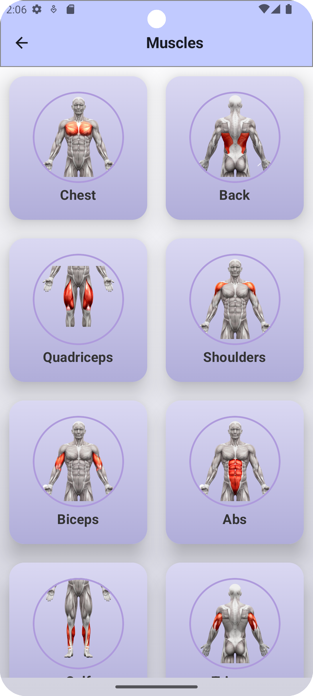
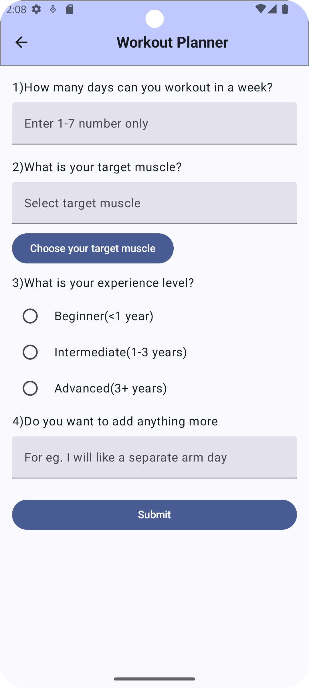
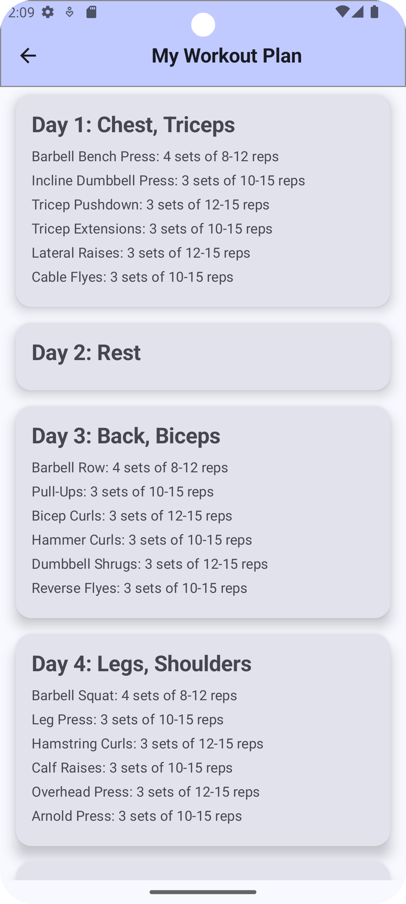

# FitLife - Your go to Fitness App
### This is an android app build on Jetpack Compose that enables you to get your customised workout using AI, gives you a bunch of exercises for different muscle group and also helps in meal planning

## Key Features
* Jetpack Compose
* Gemini AI
* NavHost

# Screenshots

  
  
  

   

  
  
  

   

  
  

